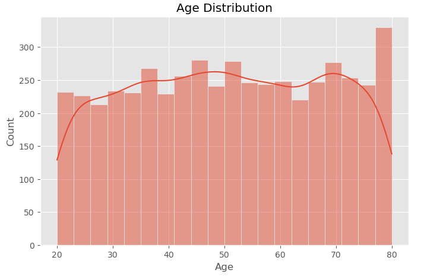
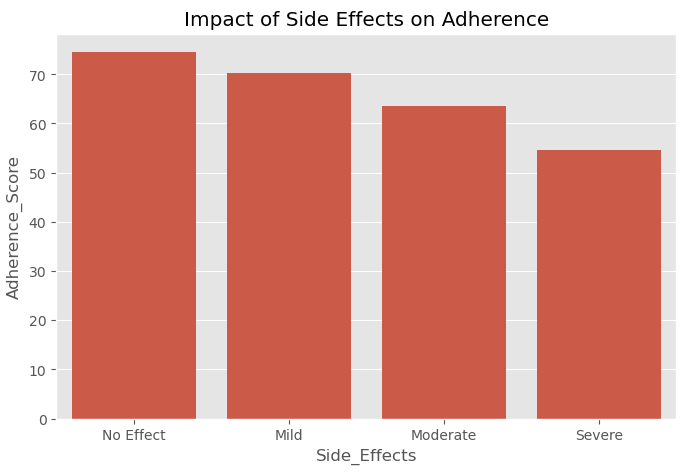
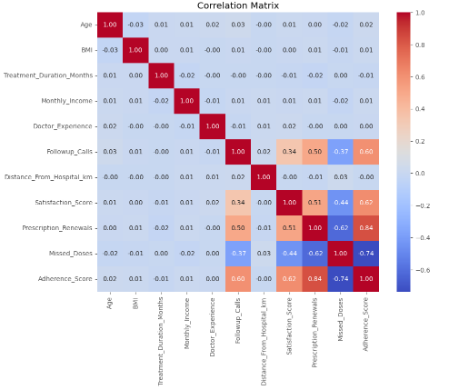
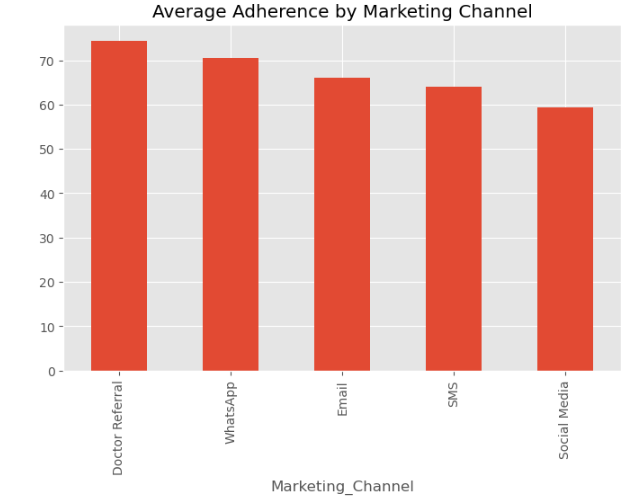

# patient-adherence-decision-analytics
Consulting-style pharmaceutical decision analytics project using Python to analyze medication adherence, patient engagement, marketing effectiveness, and executive KPIs.

## Business Problem

Medication non-adherence is one of the leading causes of poor treatment outcomes and increased healthcare costs.

This project analyzes patient behavior, physician performance, hospital effectiveness, and marketing initiatives to identify factors influencing medication adherence and provide actionable business recommendations.

## Project Objectives

- Measure medication adherence
- Identify drivers of patient retention
- Evaluate physician and hospital performance
- Assess marketing channel effectiveness
- Build executive KPIs
- Recommend data-driven interventions

  ## Analytics Workflow

Data Cleaning

↓

Exploratory Data Analysis

↓

Feature Engineering

↓

Business KPIs

↓

Patient Segmentation

↓

Marketing Analytics

↓

Charts

↓

Business Recommendations

## Business Questions

What factors influence medication adherence?

Which hospitals demonstrate the best performance?

Which physicians achieve the highest adherence?

Which marketing channels acquire high-value patients?

Does patient support improve renewals?

How do follow-up calls affect adherence?

## Executive Dashboard

Which patient segment is most at risk?
